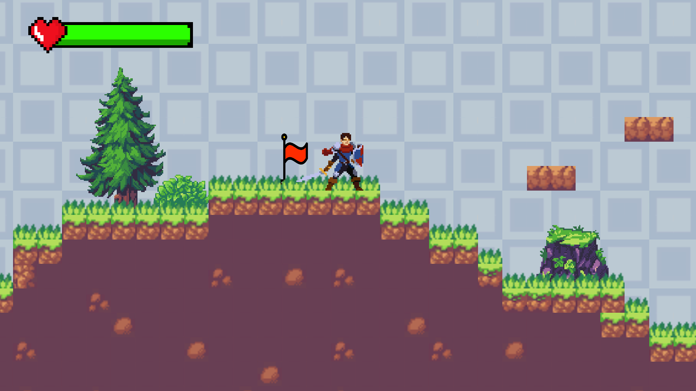
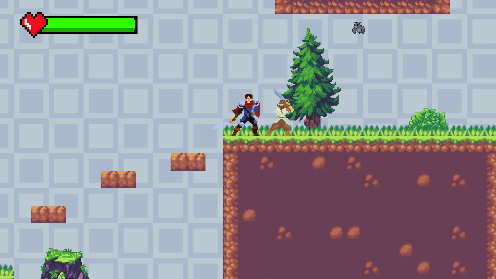
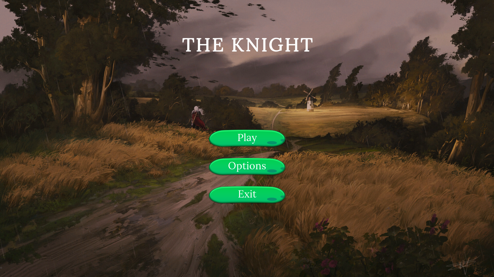
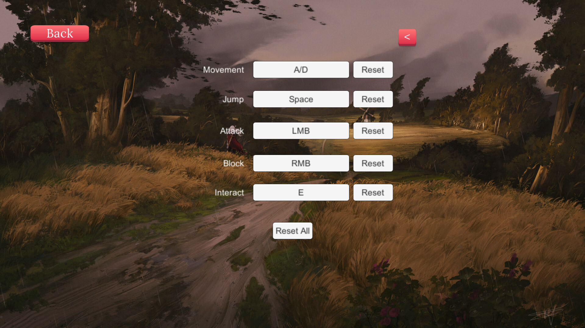
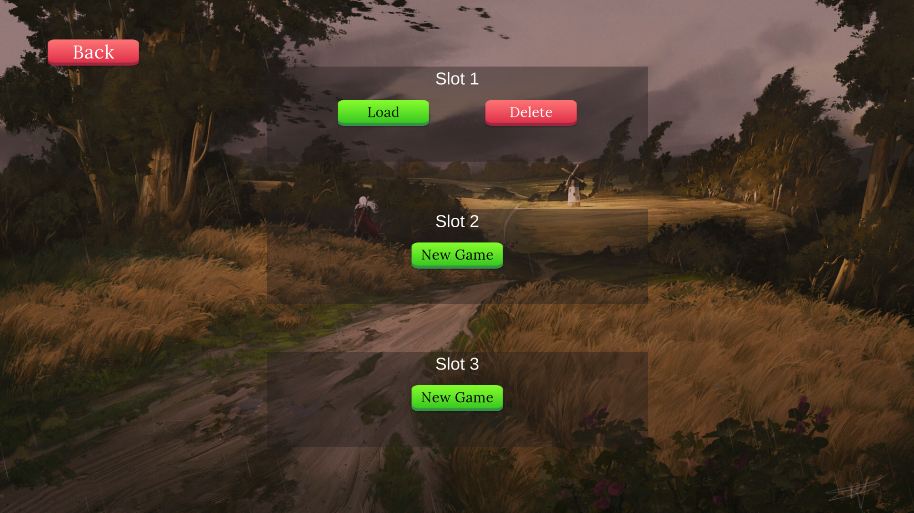

# The-Knight

## Overview
**The Knight** is a 2D side-view action-adventure platformer developed in Unity, inspired by acclaimed games such as *Hollow Knight* and *Ori and the Will of the Wisps*. This project aims to deliver engaging gameplay with a focus on exploration and combat mechanics, though it is designed on a smaller scale.

## Features
- **Gameplay Mechanics**: 
  - Block and attack actions to engage with enemies.
  - Wall jumping to navigate through levels.
  - Basic movement abilities for a dynamic player experience.
  
- **Enemies**: 
  - Three distinct types of enemies, each with unique AI behaviors, providing varied challenges for players.

- **Customizable Keybindings**: 
  - Players can change key bindings to personalize their control scheme for a more comfortable gaming experience.

##Screenshots

 

